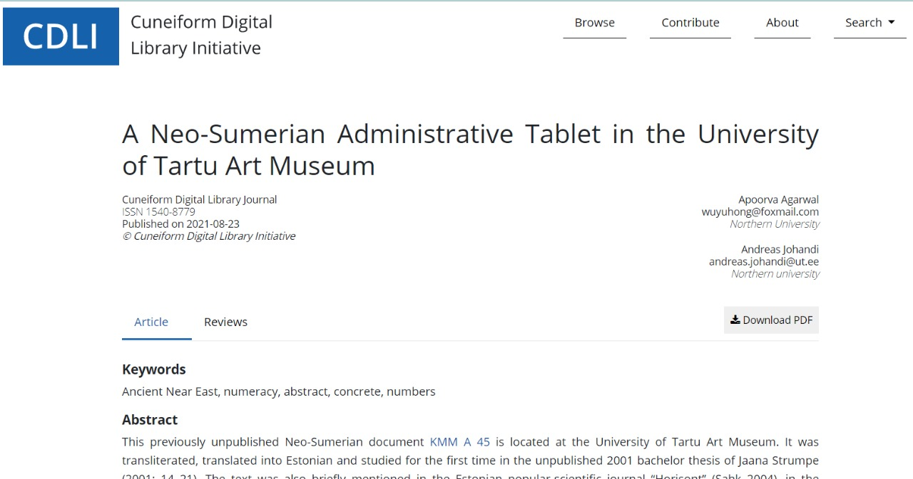

<h1 align="center" > Google Summer of Code 2021 </h1>

<i>with</i> 

<h2 align="center"><a href="https://summerofcode.withgoogle.com/organizations/4724093699489792/">Cuneiform Digital Library Initiative (CDLI)</a></h2>
<h2 align="center"> Final Report of my GSoC'21 Project </h2>

<h1> Journal Open Review Workflow And Integration </h1>

## About the project

This project focuses on creating a functional pipeline which will consist of open submission and open review process before publishing articles in our CDLI journals dashboard. To implement  open journals in the system,  an appropriate workflow needs to be developed which is intended to be carried out using https://pkp.sfu.ca/ojs/ojs_download/ software. OJS(Open Journal System) is an open source solution to managing and publishing scholarly journals online. OJS is a highly flexible editor-operated journal management and publishing system. In addition to this, we intend to make further integration in the CDLI journals dashboard and display the endorsement of reviewers with published articles.

## Links

- [Project Proposal](https://docs.google.com/document/d/1Bq1Be4UYaF08vBwasERpx2kiWuiVPWdkSEHBM-owUx4/edit#heading=h.rti1bbjk8idf)
- [Project Weekly Blogs](https://cdli-gh.github.io/blog/gsoc21/journalsOpenReviewWorkflowAndIntegration/index)
- [Contributions to CDLI](https://gitlab.com/cdli/framework/-/merge_requests?scope=all&utf8=%E2%9C%93&state=all&author_username=apoorva1509)
- [Project Google Drive](https://drive.google.com/drive/u/2/folders/15kmsiilnMfBEomd03VwUyAmDdcU-lmBV)

## Mentor: 
<a href='mailto:nisheal.work@gmail.com'>Nisheal John</a>

## Technologies

- CakePHP 3
- Javascript
- Docker
- HTML
- SCSS
- PKP/OJS

### Objectives and Deliverables

:heavy_check_mark: --> Completed Tasks

| \# | Status  | Objectives                    | Associated Deliverables         | Issues |
| --- | --- | ----------------------------- | ---------------------------------------------- | ---- |
| 1 | :heavy_check_mark: | Integrating ojs Docker Container in the framework | Downloading ojs software and creating a docker container for it | <a href="https://gitlab.com/cdli/framework/-/issues/598">#598</a> |
| 2 | :heavy_check_mark:| Ojs workflow for submission and review of articles | Creating a workflow for open submission and open review of articles | <a href="https://gitlab.com/cdli/framework/-/issues/603">#603</a> | 
| 3 | :heavy_check_mark:  |  Ojs Datbase Connection | Setup ojs connection and create relations between ojs models | <a href="https://gitlab.com/cdli/framework/-/issues/606">#606</a> |
| 4 |  :heavy_check_mark: | Write command script to move ojs submissions to cdli | Command script that will run hourly and move reviewed ojs submissions to cdli database  | <a href="https://gitlab.com/cdli/framework/-/issues/599">#599</a>  | 
| 5 |  :heavy_check_mark: | Designing single article view | Remove header from latex convertor and design single article web view page |  <a href="https://gitlab.com/cdli/framework/-/issues/470">#470</a> |
| 6 | :heavy_check_mark: |Displaying reviewers endorsements | Develop review page to display reviewers endorsements on article web page | <a href="https://gitlab.com/cdli/framework/-/issues/620">#620</a>, <a href="https://gitlab.com/cdli/framework/-/issues/659">#659</a> |

## Milestone 1 

In particular the work done in milestone 1 was

- Written dockerfile to create ojs container consisting ojs submodule
- Mount ojs database in cdli framework
- Updated CDLI journals index to create a link between CDLI journals dashboard and ojs dashboard
- Finalized single article web view design with Somil Jain
- Wrote Readme file for deploying ojs and running ojs container

### PRs Involved

- [Created docker container for ojs(!313)](https://gitlab.com/cdli/framework/-/merge_requests/313)
- [Readme file for running ojs locally(!348)](https://gitlab.com/cdli/framework/-/merge_requests/348)
- [Created a direct link between CDLI journals and ojs(!599)](https://gitlab.com/cdli/framework/-/merge_requests/599)
- [Created different fields for year of submission and article number(!291)](https://gitlab.com/cdli/framework/-/merge_requests/291)

### Summary

Milestone 1 was the most important part of my project, I wrote dockerfile to create container for ojs submodule and modified ojs configuration file and mount ojs database in CDLI framework to make the changes persistent. After successfully creating the container I wrote the documentaion to run ojs container locally or manually install it.
I created a direct link on CDLI journals index to make submission to ojs.

### Documentation

Document to run ojs container locally or to deploy it manually can be find [here](https://github.com/cdli-gh/ojs/blob/main/README.md)

## Milestone 2

The work done in Milestone 2 was

- Creating a workflow for open submission and open review of articles in ojs. 
- Creating a test submission in ojs with complete open review process
- Implementing single article web view design 
- Remove header from latex convertor

Along with this we even discussed the final workflow to be followed to integrate ojs submissions in CDLI journals dashboard and publish them.

### PR Involved

- [Implement single article web view(!368)](https://gitlab.com/cdli/framework/-/merge_requests/368)

### Summary

Changed settings of ojs editorial workflow according to CDLI and Created a test submission in ojs with complete open review process performed all the roles of an admin, editor, author and reviewers. 
Implemented single article web view design and removed header from latex convertor and improved css for content of the article.

## Milestone 3

The work done in this milestone is:

- Created command script to move reviewed ojs submissions to CDLI journals dashboard and prepopulate the CDLI database
- Update Journals admin index to add ojs reviewed submissions to CDLI database
- Display reviewers endorsements on single article web view page
- Access all the revisions of the submission from single article web view
- Testing Ojs

### PR Involved

- [Workflow to move ojs submissions to CDLI(!374)](https://gitlab.com/cdli/framework/-/merge_requests/374)
- [Debug errors in the workflow (!385)](https://gitlab.com/cdli/framework/-/merge_requests/385)

### Summary

In the last milestone of my GSoC, I created an hourly command script to move reviewed ojs to CDLI journals dashbaord and prepopulate the articles table in the CDLI database. Next I implemented the review page in single article web view to display the reviewers endorsements. Thus once the articles gets published by admins on single article web view, users can read the article with its reviewers endorsements.

## To Do (Post GSoC)

- Citations for articles
- Fix author picker
- Filter draft and published articles
- ORCHID Integration
- Create single article web view navbar for no-js users

## Learning and Success

Working on the project has been a great learning experience. My mentor has been very supportive and his inputs have been helpful in improving my work. The team meetings give a good overview of the overall progress of the projects. I like that there is always something new to learn. Few things which I learnt in my GSoC journey are:

- Learnt many new docker commands
- Learnt to debug docker related errors
- Learnt many new scss techniques
- Leant some advanced functions of cakephp and mySQL while creating command script and creating relations between ojs models
- Got more confident with git and pipeline
- Learnt time management

## Acknowledgements

- I would like to thank my mentor Nisheal John for helping and guiding me throughout the GSoC journey and teaching me so many new things !
- Thanks to other mentees and mentors for collaboration.
- I am thankful to Google Summer Of Code for providing me with an opportunity to work with CDLI.
